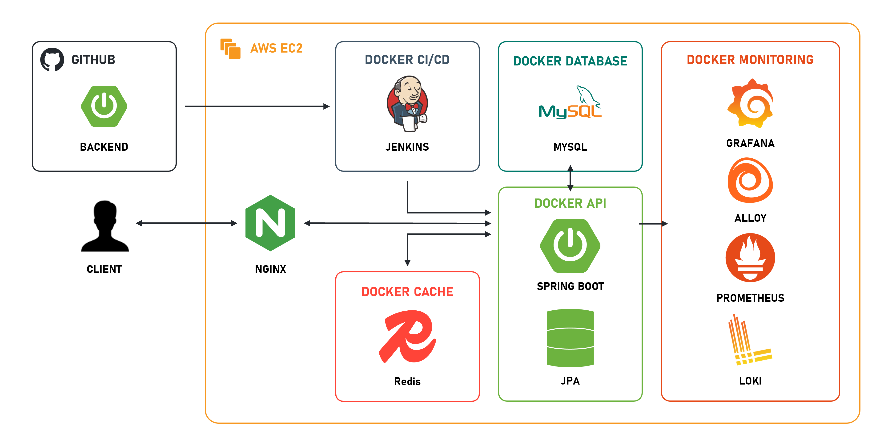

### 여행 일정 관리 플랫폼

# Trigo

## 📓 목차

1. [⭐ 사용 기술 ⭐](#사용-기술)
2. [⭐ 서비스 소개 ⭐](#서비스-소개)
3. [⭐ 기술 소개 ⭐](#기술-소개)
4. [⭐ 디렉터리 구조 ⭐](#디렉터리-구조)
5. [⭐ 시스템 아키텍쳐 ⭐](#시스템-아키텍처)

## 사용 기술

<div>
  <h3>INFRA</h3>
  
  
  
  
</div>

<div>
  <h3>BACKEND</h3>
  
  
  
  
  
</div>

<div>
  <h3>MONITORING</h3>
  
  
  
  
</div>


## 서비스 소개

### 💎 여행지 조회

- 관광지 기본정보, 운영시간, 위치, 연락처 등 세부 정보 조회 기능 포함
- 한국관광공사 TourAPI를 통해 지역 기반, 위치 기반, 키워드 기반으로 관광정보 제공 가능

<br/>

### 💎 여행 일정 관리

- 로그인 사용자의 여행 일정 생성, 수정, 삭제 기능 제공
- 여행지, 날짜, 시간 입력을 통해 새로운 일정 등록 가능
- 등록된 일정 목록 조회 및 상세 정보 확인 가능
- 다른 사용자의 공개 일정 열람 및 ‘좋아요’ 기능 제공

<br/>

### 💎 여행지 리뷰

- 여행지 또는 일정에 대한 평점 및 코멘트 작성 기능 제공
- 리뷰 목록 조회 및 상세 내용 열람 기능 포함
- 본인 작성 리뷰 수정 및 삭제 기능 제공

<br/>

## 기술 소개

### Infra
- Docker를 이용한 컨테이너화로 일관된 배포 환경 조성
- Jenkins를 활용한 CI/CD 파이프라인을 구성하여, 빌드 → 이미지 생성 → 배포 자동화를 구현
- LGTM+ stack을 이용해 모니터링 환경을 구성

### Backend
- Java 17과 Spring Boot 3.4.1을 기반의 API
- **JPA와 Querydsl, MySQL 이용**
  - 여러 엔티티 간 1:N, N:M 관계가 복합적으로 얽혀 있어, 외래 키와 조인을 통해 모델링 및 조회가 가능한 RDBMS 사용
  - 서비스 특성 상 반복 조회가 많아(여행지, 리뷰 등) 1차·2차 캐시, 지연 로딩 등을 통해 반복 조회 비용을 줄이기 위해 JPA 사용
  - 또한, ORM으로 인한 생산성과 유지보수성 향상
  - 가독성 높은 동적 쿼리를 위해 querydsl 활용 (다양한 조회 조건 구현)
- **JWT 기반 인증 및 인가**
  - access token과 refresh token으로 나누어 단계적 권한 축소를 적용
  - access token은 응답 헤더에 포함해 CSRF를 차단하고, XSS에 의한 로컬 저장소 탈취 위험 제거
  - refresh token은 HttpOnly 브라우저 쿠키로 관리하며, DB에 저장하다 로그아웃 시 제거해 즉각적 토큰 무효화를 적용
- **Redis를 이용해 더 빠른 조회 가능**
  - 네트워크 기반 분산 캐시로 확장성, 가용성, 영속성 측면에서 양호함을 보여 채택
  - 클라우드 환경의 여행 일정 관리 서비스에 많은 유저가 동시에 접속하고, 일정 등록/조회/변경 등을 처리해야 했으므로,
  그에 맞는 클라이언트인 lettuce 사용

## 디렉터리 구조
```
    ├── src
    │   ├── main
    │   │   ├── java/com/mono/trigo         # 애플리케이션 진입점 및 패키지 구조
    │   │   │   ├── common                  # 공통 활용 모듈
    │   │   │   ├── domain                  # 도메인 모델 및 엔티티 클래스
    │   │   │   ├── openApi                 # 외부 TourAPI 연동 로직
    │   │   │   └── web                     # REST 컨트롤러 및 요청 처리 계층
    │   │   └── resources                   # 설정 파일 및 정적 리소스
    │   │       ├── application.yml         # 애플리케이션 환경 설정 파일
    │   │       ├── application-secret.yml
    │   │       └── application-prod.yml
    │   └── test
    │       └── java/com/mono/trigo         # 테스트 코드
    ├── build.gradle                        # Gradle 빌드 스크립트
    ├── settings.gradle                     # Gradle 설정 파일
    ├── Dockerfile                          # Docker 이미지 빌드 설정
    └── Jenkinsfile                         # CI/CD 파이프라인 설정 파일
```

## 시스템 아키텍처
